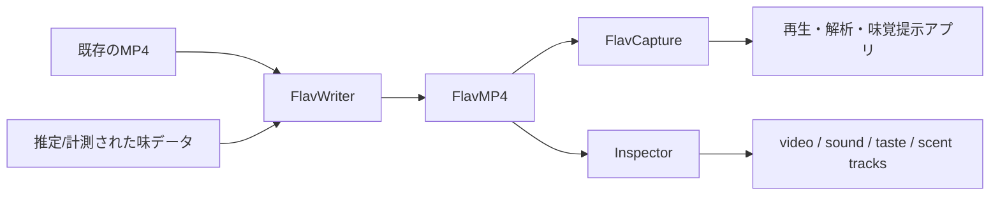
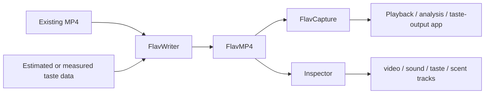

# flavpy

## 日本語

`flavpy` は、味覚情報を埋め込める MP4 ベースの形式 FlavMP4 を読み書きするための Python ライブラリです。映像に対応する味データを読み出したり、既存の MP4 に味覚トラックを追加したりする用途を想定しています。

TasteColorizer では、既存映像に含まれる飲食物を GPT-4 Vision などで推定し、その推定結果を味データとして映像に付与することで「味わえる映像」を作ることを目指しています。このリポジトリは、その FlavMP4 の読み書き部分を担います。

参考: https://www.honma.site/ja/works/TasteColorizer/

### flavpy の位置づけ



`flavpy` は `flavtool` の parser / analyzer / codec / composer を内部で使い、アプリケーションから扱いやすい `FlavCapture`、`FlavWriter`、`Inspector` を提供します。

### インストール

```bash
pip install flavpy
```

ローカルで開発する場合:

```bash
pip install -e .
```

### 味データを読み込む

```python
import flavpy

with flavpy.FlavCapture("taste.mp4", modal="taste") as cap:
    while True:
        ret, data, delta = cap.read()
        if not ret:
            break
        print(data, delta)
```

- `ret`: 読み込みに成功したかどうか
- `data`: デコードされた味データ
- `delta`: メディア時間基準のサンプル持続時間

### 任意の位置から読み込む

`FlavCapture.seek()` を使うと、フレーム番号、メディア時間、実時間のいずれかで読み込み位置を移動できます。

```python
import flavpy
from flavpy import SEEK_FRAME_INDEX, SEEK_REAL_TIME

with flavpy.FlavCapture("taste.mp4", modal="taste") as cap:
    cap.seek(120, SEEK_FRAME_INDEX)
    ret, data, delta = cap.read()
    print("frame 120:", data)

    cap.seek(3.5, SEEK_REAL_TIME)
    ret, data, delta = cap.read()
    print("at 3.5 sec:", data)
```

### 味データを書き込む

```python
import numpy as np
import flavpy

with flavpy.FlavWriter(
    "output.mp4",
    "taste",
    codec="raw5",
    fps=60,
    add_modal_on="input.mp4",
) as writer:
    for i in range(100):
        taste = np.array(
            [(i * 10) % 256, i % 256, i % 256, i % 256, i % 256],
            dtype=np.uint8,
        )
        writer.write(taste)
```

コンテキストマネージャを使わない場合は、書き込み後に `writer.export()` を呼び出してください。

### codec を選ぶ

`flavpy` では `FlavWriter(..., codec=...)` に `flavtool` の味 codec 名を指定します。

| codec | 用途 | 入力データ |
| --- | --- | --- |
| `raw5` | 基本五味など、5 次元の味ベクトルをそのまま保存する | `np.ndarray` / `dtype=np.uint8` / 長さ 5 |
| `rmix` | 複数の味物質の混合比を保存する | `np.ndarray` / `dtype=np.uint8` |

`rmix` を使う場合は、混合に使う味物質名、濃度、最大量を `MixCodecOption` として渡せます。

```python
import numpy as np
import flavpy
from flavtool.codec.codec_options import MixCodecOption

codec_option = MixCodecOption.generate(
    names=["NaCl", "CitA", "Fruc", "Pota", "Glut"],
    concentrations=[17, 17, 30, 20, 9],
    max_amounts=100,
)

with flavpy.FlavWriter(
    "mixed_taste.mp4",
    "taste",
    codec="rmix",
    fps=30,
    add_modal_on="input.mp4",
    codec_option=codec_option,
) as writer:
    writer.write(np.array([20, 5, 80, 10, 30], dtype=np.uint8))
```

### トラックを確認する

`Inspector` は、ファイルに含まれる track の種類を確認するための簡易 API です。

```python
import flavpy

inspector = flavpy.Inspector("output.mp4")
print(inspector.get_track())
# 例: ["video", "sound", "taste"]
```

### 味データだけの FlavMP4 を作る

`add_modal_on` を指定しない場合、空の MP4 構造から taste / scent track を作成します。

```python
import numpy as np
import flavpy

with flavpy.FlavWriter("taste_only.mp4", "taste", codec="raw5", fps=30) as writer:
    writer.write(np.array([10, 20, 30, 40, 50], dtype=np.uint8))
    writer.write(np.array([20, 30, 40, 50, 60], dtype=np.uint8))
```

### 構成

- `flavpy/capture/`: FlavMP4 の読み込み
- `flavpy/writer/`: FlavMP4 の書き込み
- `flavpy/inspector/`: ファイル内容の確認
- `setup.py`: パッケージ設定
- `test.py`: ローカルの使用例

### 関連リポジトリ

低レベルな MP4 の解析、味データの codec、MP4 の再構成には `flavtool` を使います。`flavpy` は、アプリケーションから扱いやすい読み書き API を提供する層です。

## English

`flavpy` is a Python library for reading and writing FlavMP4 files, an MP4-based format that can store taste data alongside video.

In the TasteColorizer project, taste values estimated from food scenes are attached to existing videos so that viewers can interact with and taste specific parts of the video. This repository provides the FlavMP4 capture/write layer.

Reference: https://www.honma.site/ja/works/TasteColorizer/

### Role of flavpy



`flavpy` wraps the lower-level parser, analyzer, codec, and composer features from `flavtool` into application-facing APIs.

### Install

```bash
pip install flavpy
```

For local development:

```bash
pip install -e .
```

### Read Taste Data

```python
import flavpy

with flavpy.FlavCapture("taste.mp4", modal="taste") as cap:
    while True:
        ret, data, delta = cap.read()
        if not ret:
            break
        print(data, delta)
```

### Seek Before Reading

```python
import flavpy
from flavpy import SEEK_FRAME_INDEX, SEEK_REAL_TIME

with flavpy.FlavCapture("taste.mp4", modal="taste") as cap:
    cap.seek(120, SEEK_FRAME_INDEX)
    ret, data, delta = cap.read()
    print("frame 120:", data)

    cap.seek(3.5, SEEK_REAL_TIME)
    ret, data, delta = cap.read()
    print("at 3.5 sec:", data)
```

### Write Taste Data

```python
import numpy as np
import flavpy

with flavpy.FlavWriter("output.mp4", "taste", codec="raw5", fps=60, add_modal_on="input.mp4") as writer:
    for i in range(100):
        taste = np.array([(i * 10) % 256, i % 256, i % 256, i % 256, i % 256], dtype=np.uint8)
        writer.write(taste)
```

If you do not use the context manager, call `writer.export()` after writing.

### Choose a Codec

`FlavWriter(..., codec=...)` accepts taste codec names provided by `flavtool`.

| codec | Use case | Input data |
| --- | --- | --- |
| `raw5` | store a 5-dimensional taste vector directly | `np.ndarray`, `dtype=np.uint8`, length 5 |
| `rmix` | store a mixture ratio for multiple taste substances | `np.ndarray`, `dtype=np.uint8` |

For `rmix`, pass the mixture metadata with `MixCodecOption`.

```python
import numpy as np
import flavpy
from flavtool.codec.codec_options import MixCodecOption

codec_option = MixCodecOption.generate(
    names=["NaCl", "CitA", "Fruc", "Pota", "Glut"],
    concentrations=[17, 17, 30, 20, 9],
    max_amounts=100,
)

with flavpy.FlavWriter(
    "mixed_taste.mp4",
    "taste",
    codec="rmix",
    fps=30,
    add_modal_on="input.mp4",
    codec_option=codec_option,
) as writer:
    writer.write(np.array([20, 5, 80, 10, 30], dtype=np.uint8))
```

### Inspect Tracks

```python
import flavpy

inspector = flavpy.Inspector("output.mp4")
print(inspector.get_track())
# Example: ["video", "sound", "taste"]
```

### Create a Taste-Only FlavMP4

```python
import numpy as np
import flavpy

with flavpy.FlavWriter("taste_only.mp4", "taste", codec="raw5", fps=30) as writer:
    writer.write(np.array([10, 20, 30, 40, 50], dtype=np.uint8))
    writer.write(np.array([20, 30, 40, 50, 60], dtype=np.uint8))
```

### Structure

- `flavpy/capture/`: FlavMP4 capture API
- `flavpy/writer/`: FlavMP4 writer API
- `flavpy/inspector/`: file inspection helpers
- `setup.py`: package metadata
- `test.py`: local usage example
